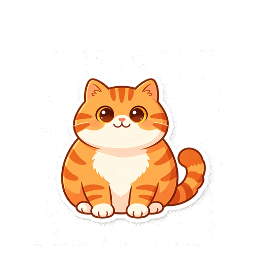

# 团团桌宠 (Tuantuan Pet)

一只圆滚滚的橘白胖橘猫 Electron 桌面宠物，在你的桌面上陪你工作、学习和发呆。



## ✨ 功能特性

### 🐱 角色互动
- **18 个动画状态**：待机呼吸、眨眼、点击开心、摸头、喂小鱼干、逗猫棒、提醒呼叫、贴边偷看、睡觉、打哈欠、舔爪子、追尾巴、摸肚子、踩奶、爬墙、跳舞、抓痒、走路
- **6 个互动**：摸头 😻、喂小鱼干 🐟、逗猫棒 🪶、摸肚子 🤚、跳舞 💃、爬墙 🧗
- **随机空闲动作**：每 20-30 秒随机播放眨眼、打哈欠、舔爪子、追尾巴、踩奶、抓痒等动作
- **自动睡眠**：3 分钟无互动后自动进入睡眠状态，点击唤醒
- **随机走路**：每 1-2 分钟随机走动
- **好感度系统**：互动积累好感度，心情随互动变化

### 🖥️ 窗口体验
- **透明窗口**：猫身之外的区域自动穿透，不挡桌面操作
- **智能拖拽**：5px 位移阈值区分点击与拖拽，摸头不会误拖走猫
- **贴边吸附**：拖到屏幕边缘自动隐藏为 16px 窄条，鼠标悬停弹出
- **多显示器适配**：自动识别当前显示器工作区
- **透明度调节**：30%–100% 实时可调

### ⏰ 提醒系统
- **快速创建**：1/5/10/30/60 分钟快捷按钮
- **到点弹窗**：猫贴边出现气泡显示提醒文字，点击气泡打开详情
- **托盘快速入口**：右键托盘图标即可设置提醒

### ⚙️ 基础配置
- **开机自启**：系统级登录项管理
- **音效开关**：Web Audio 合成提示音
- **退出确认**：防止误退出
- **数据备份**：一键导出/导入 JSON（好感度、设置、提醒）

## 🚀 快速开始

### 下载安装包

前往 [Releases](https://github.com/feng20854684/tuantuan-pet/releases) 下载对应平台的安装包：

| 平台 | 格式 | 说明 |
|------|------|------|
| Windows | `.exe` (Squirrel) | 双击安装，自动更新 |
| macOS | `.dmg` | 拖拽到 Applications |
| Linux | `.zip` | 解压后运行 |

> macOS 未签名，首次打开需右键 → 打开。

### 从源码运行

```bash
# 需要 Node.js 18+
npm ci

# 启动开发预览（源码运行，不打包）
npm run dev
```

## 📜 命令说明

| 命令 | 说明 |
|------|------|
| `npm run dev` | 启动开发预览（Forge 开发服务器，热更新） |
| `npm start` | 同 `dev` |
| `npm run check` | 运行全部静态检查（类型、契约、素材、UI、体验 QA） |
| `npm test` | 运行单元测试 |
| `npm run test:dev-smoke` | 开发冒烟测试（验证窗口启动） |
| `npm run qa:assets` | 素材 QA（尺寸、透明、锚点、尺度漂移） |
| `npm run qa:experience` | 体验 QA（状态可达、互动入口、帧数） |
| `npm run qa:ui` | UI QA（透明宿主、无滚动条、托盘图标） |
| `npm run process:assets` | 处理素材（去白底、归一化 512×512） |
| `npm run doctor` | 环境诊断 |
| `npm run package:win` | 构建 Windows 可运行目录 |
| `npm run make:win` | 构建 Windows 安装包 (Squirrel .exe) |
| `npm run portable:win` | 构建 Windows 便携版 (.zip) |
| `npm run package:mac` | 构建 macOS .app |
| `npm run make:mac` | 构建 macOS .dmg |
| `npm run portable:mac` | 构建 macOS 便携版 (.zip) |

## 📁 项目结构

```
├── src/
│   ├── main.ts              # Electron 主进程
│   ├── preload.ts           # 预加载脚本（contextBridge）
│   ├── shared/
│   │   └── contracts.ts      # 共享类型和 IPC 契约
│   ├── main/
│   │   ├── drag.ts          # 拖拽和贴边逻辑
│   │   ├── logger.ts         # JSONL 日志
│   │   ├── persistence.ts   # 原子 JSON 持久化
│   │   ├── typing-listener.ts # 全局打字监听
│   │   └── data-validation.ts # 设置/统计校验
│   ├── renderer/
│   │   ├── pet/             # 桌宠窗口（状态机、动画）
│   │   ├── dashboard/       # 面板（统计、设置、预览）
│   │   └── reminder/         # 提醒窗口
│   └── assets/
│       ├── pet/             # 处理后的 43 张动画帧 (512×512)
│       └── tray/            # 托盘图标
├── incoming-assets/          # 原始素材（AI 生成）
├── tools/                   # 构建和 QA 脚本
├── tests/
│   ├── unit/               # 单元测试
│   └── e2e/                # E2E 测试
├── pet-spec.json            # 角色配置（8 状态、3 互动、主题色）
├── forge.config.js          # Electron Forge 配置
└── package.json
```

## 🔧 开发指南

### 修改角色

所有角色定义在 `pet-spec.json`：
- `states`：动画状态（帧、触发、帧速、优先级）
- `experience.interactions`：互动（emoji、文案、状态、好感度）
- `experience.theme`：主题色板
- `motion`：呼吸、回弹、随机间隔

修改后运行 `npm run check` 验证。

### 添加新动画状态

1. 在 `pet-spec.json` 的 `states` 中添加状态定义
2. 将帧图片放入 `incoming-assets/`
3. 运行 `npm run process:assets` 处理素材
4. 在 Dashboard 预览面板中测试

### 调试

- 开发模式下按 `Ctrl+Shift+I` 打开 DevTools
- Dashboard 有动画预览面板，可单独播放任意状态
- 日志位于 `userData/logs/app.jsonl`

## ❓ 常见问题

**Q: 桌宠不显示？**
A: 检查是否被拖到了屏幕边缘（贴边模式）。将鼠标移到屏幕边缘窄条处，猫会弹出。

**Q: 点击猫没反应？**
A: 确认鼠标穿透模式未开启。右键托盘图标，检查"鼠标穿透"是否勾选。

**Q: 如何重置好感度？**
A: 删除 `userData/pet-stats.json`，或在 Dashboard 设置中导出后删除再导入。

**Q: macOS 提示"无法打开"？**
A: 因为应用未签名。右键点击应用 → 选择"打开" → 确认即可。

**Q: 数据存在哪里？**
A: 所有数据（好感度、设置、提醒）存储在 Electron 的 `userData` 目录：
- Windows: `%APPDATA%/团团桌宠/`
- macOS: `~/Library/Application Support/团团桌宠/`
- Linux: `~/.config/团团桌宠/`

**Q: 开机自启不生效？**
A: 检查系统设置中的登录项管理，团团桌宠可能在 macOS 的"系统设置 → 通用 → 登录项"中被禁用。

## 🏗️ 从源码构建

```bash
# Windows
npm ci
npm run package:win    # 输出到 release/

# macOS
npm ci
npm run package:mac    # 输出到 out/

# 自动发布到 GitHub Release（需要 push tag）
git tag v1.0.0
git push origin v1.0.0
```

GitHub Actions 会自动在 tag push 时构建全平台安装包并发布到 Releases。

## 📄 许可证

[MIT](LICENSE) © feng20854684
